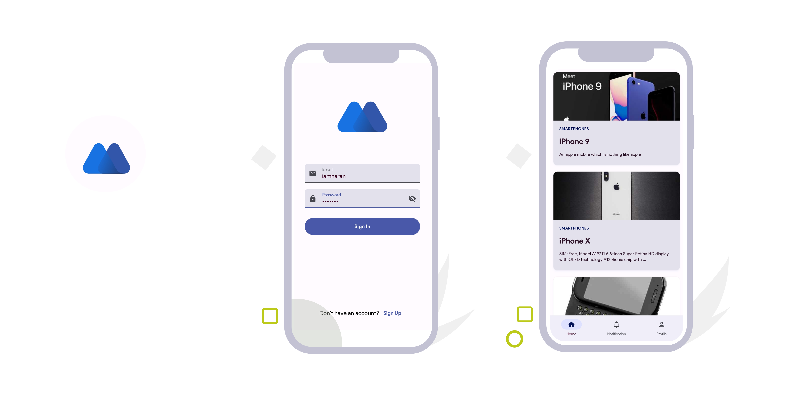

# Jetpack Compose Template App

A production-ready template app to kickstart your Android development journey with Jetpack Compose.

## Features

- **Jetpack Compose**
- **Dependency Injection - Hilt**
- **Navigation Graph**: 
- **Nested Navigation Graph**
- **Splash Screen API**
- **Clean Architecture**
- **Kotlin Flow**
- **Room**
- **Retrofit**
- **Data Store Preference**
- **Login Authentication**
- **Kotlin Coroutine NetworkResourceBound**
- **Product Listing with Offline First**

## API Integration with DummyJSON API

Thanks to the DummyJSON API, you can find the new username and password here: [GitHub - DummyJSON](https://github.com/Ovi/DummyJSON) or [DummyJSON Documentation](https://dummyjson.com/docs/auth).

## TODO
- Minor optimization
- Bluetooth Low Energy Implementation in Jetpack Compose
- Connect this firefly app with [beetle](https://github.com/iamnaran/beetle) wear os app

## INFO
**Kotlin Multiplatform App**
Clone of this App "[jellyfish](https://github.com/iamnaran/jellyfish)" is currently in the development phase.
Stay tuned for further updates!

## Getting Started

1. Clone the repository.
2. Open the project in Android Studio.
3. Build and run the app on your device or emulator.

Feel free to explore the codebase, customize components, and integrate additional features based on your project requirements.

